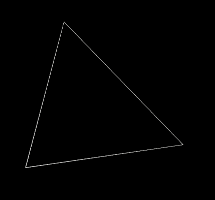
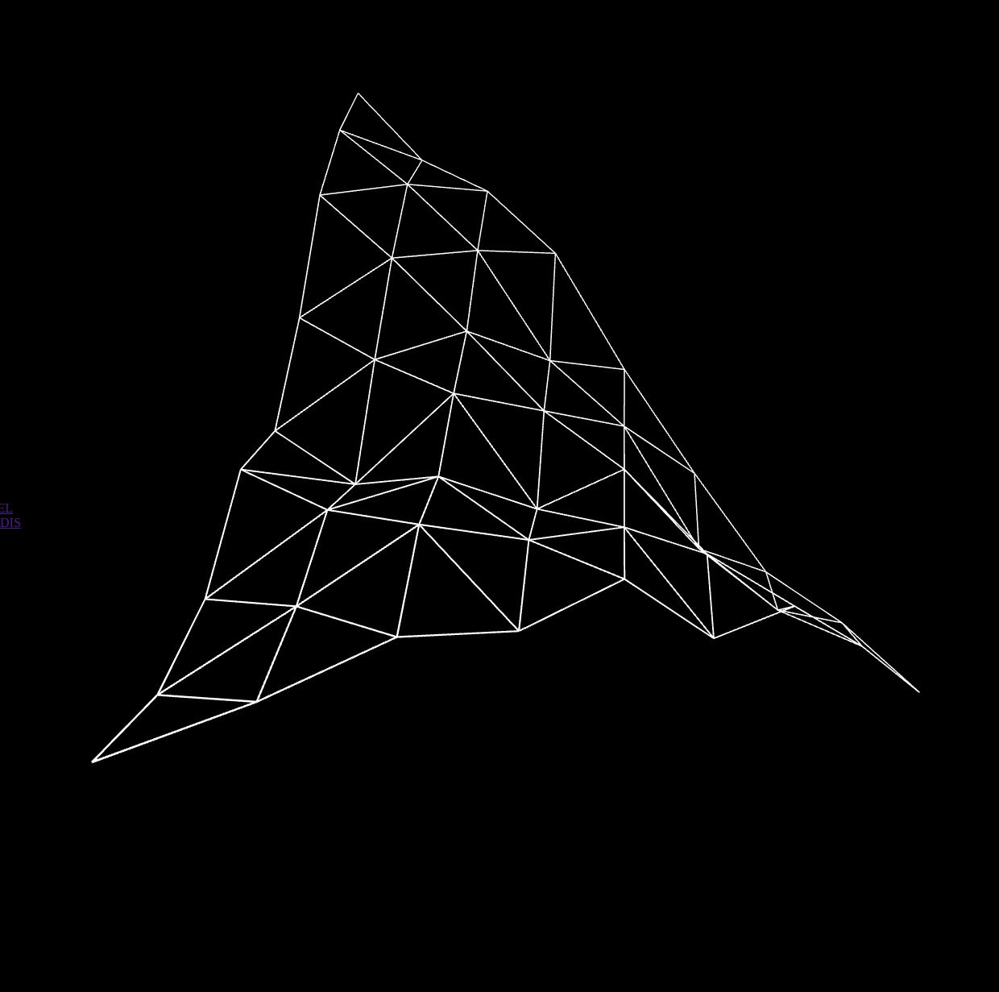
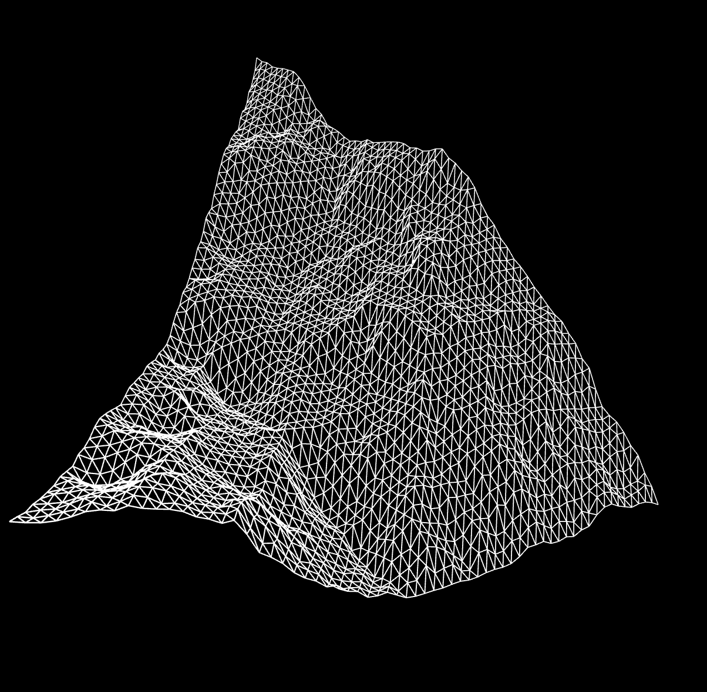

  
  <h1>fractal mountain</h1>
  
  

  <h4>A single triangle transforms into a mountain.</h4>

  <h3><a href="https://perlin-landscape.netlify.app/">Visit</a></h3>

  

## Technologies Used

&nbsp;&nbsp;&nbsp;&nbsp;&nbsp;&nbsp;

&nbsp;&nbsp;&nbsp;&nbsp;&nbsp;&nbsp;

&nbsp;&nbsp;&nbsp;&nbsp;&nbsp;&nbsp;

&nbsp;&nbsp;&nbsp;&nbsp;&nbsp;&nbsp;

## Description

A single triangle transforms into a mountain. An equilateral triangle and recursively subdividing it into smaller and smaller triangles. As each triangle is subdivided, each new midpoint generated is raised or lowered by a random amount. Made with p5.js.

Rotation can be controlled with mouse.

Double-click anywhere to enter fullscreen mode, double-click again (or press ESC) to leave fullscreen mode.

## Screenshot

## License

Copyright (c) 2023 Michael Kolesidis 
Licensed under the [GNU Affero General Public License v3.0](https://www.gnu.org/licenses/agpl-3.0.html).
